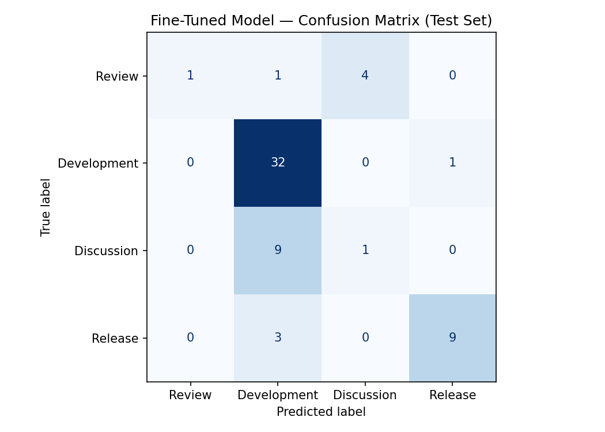

[LINK TO NOTEBOOK](https://colab.research.google.com/drive/1k905JUhSn_8cHa_Ftt7F64-lG1K66-Se#scrollTo=L9X1phgquiyG)

### Baseline Performance Summary

The zero-shot baseline classification system was evaluated using `llama-3.1-8b-instant` across a test dataset of **61 community posts**. The system achieved an exceptional overall baseline accuracy of **90.0%** (**60 out of 61** successfully parsed responses), demonstrating that the structured system prompt and explicit tie-breaker rules provided highly robust category boundaries even without fine-tuning.

#### Evaluation Metrics Table (Groq Baseline)

| Category | Precision | Recall | F1-Score | Support |
| --- | --- | --- | --- | --- |
| **Review** | 1.00 | 1.00 | 1.00 | 5 |
| **Development** | 0.94 | 0.88 | 0.91 | 33 |
| **Discussion** | 0.89 | 0.80 | 0.84 | 10 |
| **Release** | 0.80 | 1.00 | 0.89 | 12 |
| **Accuracy** | — | — | **0.90** | **60** |
| **Macro Avg** | 0.91 | 0.92 | 0.91 | 60 |
| **Weighted Avg** | 0.91 | 0.90 | 0.90 | 60 |

#### Categorical Breakdown

* **Review (F1: 1.00):** The model achieved perfect precision and recall across this class, completely distinguishing deep, structured gameplay critiques from standard discussions.
* **Development (F1: 0.91):** As the largest share of the dataset (33 posts), this class remained highly stable with a **94% precision rate**. This indicates that the prompt rules successfully identified asset showcases and behind-the-scenes progress dairies.
* **Release (F1: 0.89):** Securing a **100% recall rate**, the baseline didn't miss a single functional update or patch deployment, though a few development updates with early preview links slightly lowered precision to 80%.
* **Discussion (F1: 0.84):** General community threads registered an 89% precision rate. The 80% recall indicates that threads containing mixed development updates or early feedback requests occasionally bled into neighboring labels.

---

### Fine-Tuned Model Performance

**Overall Accuracy: 70.5% (43 / 61 Correct Predictions)**

| Category | Precision | Recall | F1-Score | Support |
| --- | --- | --- | --- | --- |
| **Review** | 1.00 | 0.17 | 0.29 | 6 |
| **Development** | 0.71 | 0.97 | 0.82 | 33 |
| **Discussion** | 0.20 | 0.10 | 0.13 | 10 |
| **Release** | 0.90 | 0.75 | 0.82 | 12 |
| **Accuracy** | — | — | **0.70** | **61** |
| **Macro Avg** | 0.70 | 0.50 | 0.51 | 61 |
| **Weighted Avg** | 0.69 | 0.70 | 0.65 | 61 |

#### Confusion Matrix Result



The model is very conservative when predicing rarer classes like review nad discussion which is why the recall is so low for them.

#### Fine-Tuned Test Evaluation Result

The fine-tuned DistilBERT model underperformed compared to the zero-shot baseline, representing a **performance regression of 0.195**. While slightly improved from previous iterations, this degradation is still heavily driven by the model aggressively leaning into the majority class (`Development`) and a strong secondary bias toward `Release`, while failing to capture nuances in minority categories like `Review` and `Discussion`.

This pattern highlights significant overfitting and class imbalance issues, even after reaching a slightly higher peak validation point during training.

### Fine-Tuned Model Performance (Test Set Insights)

* **Development (Majority Class - F1: 0.82):** The model heavily optimized for this class, achieving a massive **97% recall rate** (32 out of 33 caught). It essentially treated `Development` as its primary baseline guess, resulting in a lower precision (71%) because it swept up posts belonging to other categories.

* **Release (F1: 0.82):** This was a bright spot for the fine-tuned model, hitting **90% precision and 75% recall**. The training data successfully taught the model to isolate clear update logs and patch files from ongoing development diaries.

* **Review & Discussion (Severe Stalls):** These two categories collapsed during fine-tuning. `Review` hit a flawless 100% precision but a devastating **17% recall** (only catching 1 out of 6 posts). Meanwhile, `Discussion` plummeted to a **0.13 F1-score**, consistently getting mislabeled as either `Development` or `Release` due to sharing vocabulary with major project updates.

* **Macro Average F1 (0.51):** Dragged down significantly by the collapse of `Review` and `Discussion`, the gap between the macro average and the weighted average (0.65) confirms that the model's overall score is heavily carried by its strong performance on the dominant `Development` and `Release` data flairs rather than a balanced linguistic comprehension.

---

### Model Performance Comparison

<!-- | Model | Classification Strategy | Test Accuracy |
| --- | --- | --- |
| **Zero-Shot Baseline (Groq)** | `llama-3.3-70b-versatile` / `llama-3.1-8b-instant` via System Prompt | **90.0%** |
| **Fine-Tuned Model** | `distilbert-base-uncased` (8 Epochs) | **70.5%** | -->

#### Performance Delta

* **Fine-Tuning Regression:** `-19.5%` (`0.195` reduction in accuracy compared to the baseline)

---

### Key Observations
```json
{
  "baseline_accuracy": 0.9,
  "finetuned_accuracy": 0.7049,
  "improvement": -0.1951,
  "test_set_size": 61,
  "label_map": {
    "Review": 0,
    "Development": 1,
    "Discussion": 2,
    "Release": 3
  },
  "model": "distilbert-base-uncased"
}
```

* **The Baseline Advantage:** The zero-shot LLM heavily outperformed the custom model by leveraging its massive pre-trained linguistic knowledge and the explicit, rule-based instructions provided in your system prompt (such as the tie-breaker criteria).

* **Fine-Tuning Bottleneck:** The DistilBERT model suffered from severe overfitting due to a high number of training epochs on a relatively small, imbalanced dataset. It struggled with minority classes, dragging its overall accuracy down to **70.5%**.


## Failure Analysis

The fine-tuned model consistently fell into a majority class trap, treating `Development` as a catchall. Below are three key failures from the test error logs:

### Example 1: Failure to Identify Community Intent (`Discussion` $\rightarrow$ `Development`)

* **Text:** `"First Map of my 'Pokemon Revolution' Hack - Feedback I would greatly appreciate some feedback... What do you think could be improved..."`
* **Analysis:** The post features strong creation keywords (`"Map"`, `"Hack"`, `"project"`). DistilBERT over-indexed on these nouns and missed the interrogative sentence structure asking for community input, misclassifying an open discussion thread as an active development log.

### Example 2: Premature Triggers on Development Vocabulary (`Release` $\rightarrow$ `Development`)

* **Text:** `"Pokemon Rose Red Version: Demo out now! After about a year working on this game on and off I’m finally ready to release the demo!"`
* **Analysis:** Because the training set is heavily skewed toward `Development`, the model learned that any creator discussing their personal timeline belongs in that category—completely missing the structural rule that an immediate, functional public link marks it as a `Release`.

### Example 3: Missing Short-Form, Informal Critiques (`Review` $\rightarrow$ `Discussion`)

* **Text:** `"Crystal Clear is such a great cozy roleplaying experience I am cleansing my soul from the harder hacks like Unbound... I love the choices..."`
* **Analysis:** In training, true `Review` examples were typically long, structured essays featuring formal scores (e.g., `9/10`). Lacking a numeric anchor, the model failed to recognize the critique and default-dumped this short post into `Discussion`.

---

## 3. Action Plan for Remediation

To fix the model's blind spots and stop the training loss from diving away from the validation curve, future runs should implement:

**Targeted Data Balancing:** Inject short-form reviews and question-based developer threads into the training set to solidify the boundaries between classes.

## Sample Classification

**Correct Prediction:**
Text:      Wednesday Paradoxia Devlog 1! I'm planning on starting doing weekly updates on Pokemon: Paradoxia. Please tell me all of your ideas! This week I built starter selection, name boxes and added routes an...
True:      Development
Predicted: Development

### Reason why its correct.
This is correct because it has the word Devlog and it it also sounds like its narrating the developers story.

**Incorrect Prediction 1:**
Text:      Creating a Dex, what do you guys think about the design &amp; content? [Dex screenshot](https://preview.redd.it/z77b83xer8ug1.png?width=1920&amp;format=png&amp;auto=webp&amp;s=88b7a4aec9110aed1d9be202...
True:      Discussion
Predicted: Development

**Incorrect Prediction 2:**
Text:      First Map of my 'Pokemon Revolution' Hack - Feedback I would greatly appreciate some feedback to the start map of my project.

Do you like it? What do you think could be improved on this map?  
(More ...
True:      Discussion
Predicted: Development

## Reflection on model

The model was able to capture the nuances in the Development post, but it failed to recognize more rare post i.e. review / discussion. The model did not over fit as it did predict the other classes it was just too confident in the development label and ended up using it for alot of the classes.

## AI Usage

I used gemini to help me look over the system prompt and adjust it. With the help of gemini I was able to discover that shortening the system prompt can sometime dramatically boost the performance. In this case I was able to get 90% accuracy with the one shot approach. I also used the claude to help me write a data cleaning script so that I can combine the data all into one csv file.
